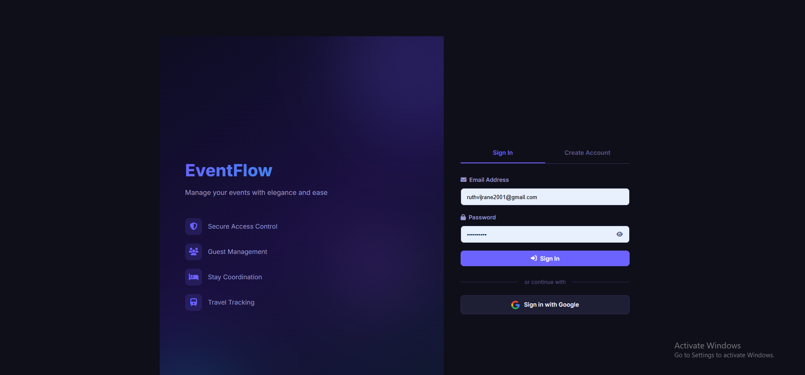
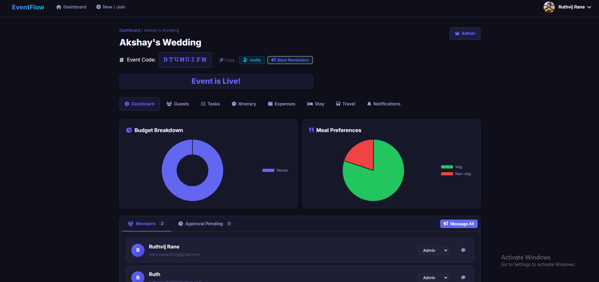
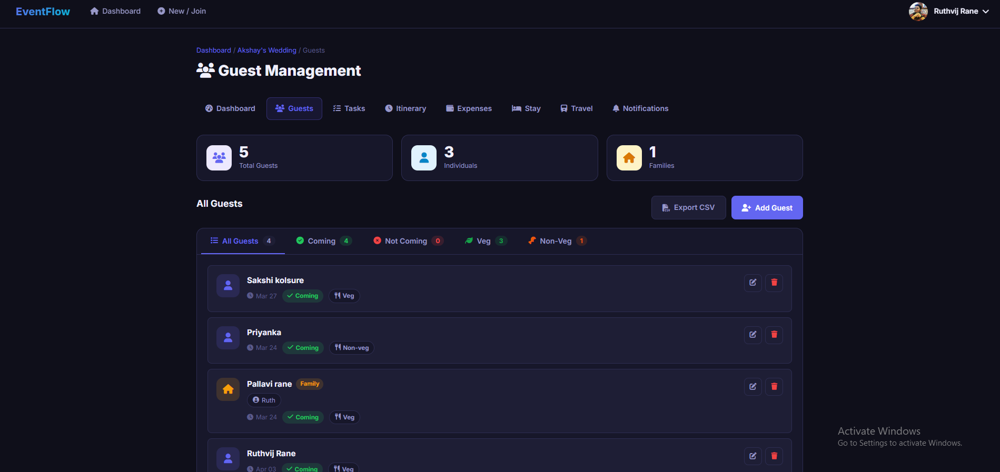
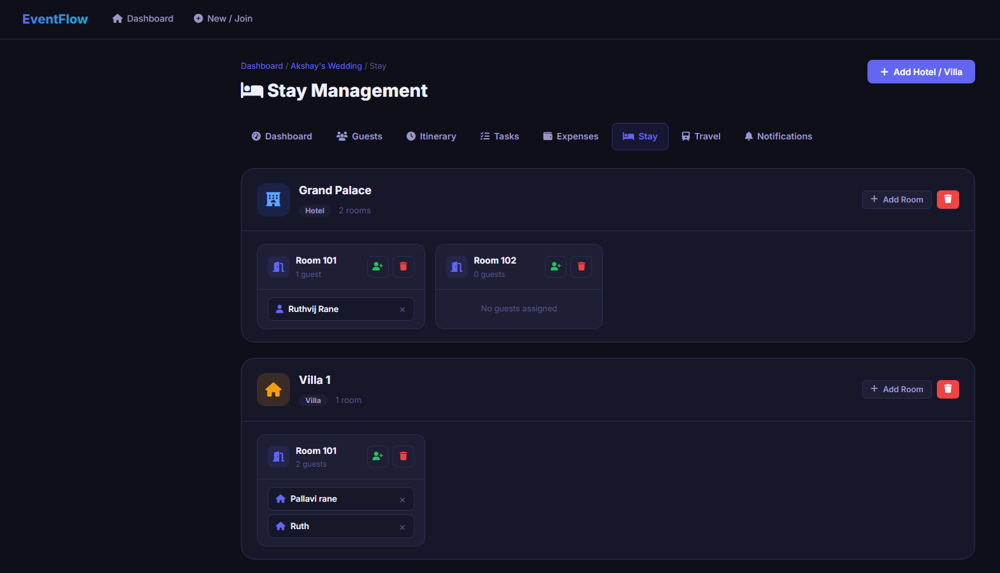

<div align="center">
  <!-- Replace the URL below with your actual project logo -->
  
  
  <h1>✨ EventFlow - Event Management App</h1>
  <p><i>A comprehensive, secure, and modern web platform for planning, creating, and tracking events seamlessly.</i></p>

  <!-- Badges -->
  <p>
    
    
    
    
    
  </p>
</div>

<br>

EventFlow helps users elegantly handle everything from advanced guest list management and RSVPs to travel arrangements and shared expenses. Armed with robust features including secure multi-factor authentication, role-based access control, automated transactional emails, and an intuitive UI dashboard, EventFlow caters to event owners and attendees alike.

---

## 📸 Screenshots

> **Note:** To display your actual app screenshots here, take screenshots of your website, place them in a folder called `screenshots/` in your repository root, and match the file names below (or update the paths).

| 🔒 **Secure Authentication** | 🎛️ **Main Dashboard** |
| :---: | :---: |
|  |  |
| *Log in via Google OAuth or OTP based email verification.* | *Overview of all joined events, stats, and pending join requests.* |

| 👥 **Guest List & RSVP** | 🏨 **Stay Management** |
| :---: | :---: |
|  |  |
| *Manage families, individual preferences, and shareable RSVPs.* | *Organize accommodations and coordinate room allocations for guests.* |

---

## 🚀 Key Features

### 🛡️ Authentication & Security
- **Secure Handling:** Standard Sign-Up/Log-In using robust hashing (`Flask-Bcrypt`).
- **Identity Verification:** Email Verification utilizing OTPs (One Time Passwords).
- **Social Login:** Quick sign-in through **Google OAuth 2.0**.
- **Anti-Abuse:** Embedded CSRF security (`Flask-WTF`), HTTP Headers (`Flask-Talisman`), and endpoint rate-limiting (`Flask-Limiter`).

### 🎪 Event Management
- **Creation & Joining:** Make custom events producing unique, shareable join codes.
- **Collaborative Ecosystem:** Invite guests; support role-based access control (Admin, Manager, Member).
- **Centralized Command:** An elegant **Event Dashboard** to view overviews and moderate activities.

### 🧰 The Planning Toolkit
- **👥 Guests:** Maintain granular control over guest states, families, meal preferences, and RSVP statuses. One-click CSV export functionality.
- **💸 Expenses:** Track financial costs and budgets attached automatically to your event.
- **📅 Itinerary:** Plan, arrange, and broadcast chronological timelines.
- **✈️ Stay & Travel:** Map out accommodations and logistics for distant attendees.
- **📋 Tasks:** Create organizational sprints, dispatch to-do items among managers, and monitor progression.

### 📧 Email Notifications
- **Automated Workflow:** Dispatches beautifully formatted transactional emails via SMTP for event invites, pending join requests, admin approvals, and 2FA OTP codes.

### 📱 Progressive Web App (PWA) Ready
- Includes a base `manifest.json` and customized Service Worker (`sw.js`) allowing for offline-caching and install-to-home-screen capabilities.

---

## 🛠 Tech Stack

- **Backend Logic:** Python, Flask server, PyMongo (optimized maxPoolSize for scale).
- **Frontend Architecture:** HTML5, CSS3, JavaScript (Vanilla), and Jinja2 templating.
- **Database Engine:** MongoDB (designed for clustered or serverless deployments).
- **Deployments:** Production ready specifically for Vercel environments (via `vercel.json` and WSGI proxies).

---

## ⚙️ Setup and Installation

### 📋 Prerequisites
- **Python 3.8+** installed locally
- A **MongoDB instance** (e.g., MongoDB Atlas Cloud)
- An active **SMTP App Password** / server for firing emails (Gmail, SendGrid, etc.)
- A Application registered via **Google Cloud Console** (to obtain Google Dev OAuth Credentials)

### 1️⃣ Clone the repository
```bash
git clone <repository_url>
cd "Event management app"
```

### 2️⃣ Install dependencies
Use your preferred virtual environment (`venv`), then run:
```bash
pip install -r requirements.txt
```

### 3️⃣ Configure Environment Variables
Create a `.env` file in the root directory and populate it with the secrets necessary to unlock functionality:
```env
# Flask Core
SECRET_KEY=your_secure_secret_key_here
DATABASE_URL=mongodb+srv://<username>:<password>@cluster.mongodb.net/event_app

# SMTP Emial Settings
MAIL_SERVER=smtp.example.com
MAIL_PORT=587
MAIL_USERNAME=your_email@example.com
MAIL_PASSWORD=your_email_app_password

# Google OAuth Integrations
GOOGLE_CLIENT_ID=your_google_client_id
GOOGLE_CLIENT_SECRET=your_google_client_secret

# Optional Proxy override for local Google auth
# GOOGLE_REDIRECT_URI=http://localhost:5000/google-callback
```
> *For further guidance, consult the dedicated guides included in this repo: `SMTP_SETUP_GUIDE.md`, `google_setup_guide.md`, and `mongodb_setup_guide.md`.*

### 4️⃣ Initialize Database Architecture
For first time deployment, initiate unique indexes across your MongoDB clusters. First, run the app, then visit `http://127.0.0.1:5000/init-db` in your browser.

### 5️⃣ Run the application
```bash
flask run
```
The application will securely serve your endpoints locally at `http://127.0.0.1:5000`.

---

## ☁️ Deployment instructions

This app is natively pre-configured and optimized to handle edge environments like **Vercel**.
1. Push your repository code to GitHub.
2. Import the project within Vercel.
3. Vercel will auto-detect the `vercel.json` routing configuration proxy.
4. Input all the `.env` variables into the **Vercel Environment Variables Console**.
5. Deploy securely. The `certifi` module handles MongoDB trusted certificates seamlessly.

---

<p align="center"><i>Crafted for effortless event orchestration.</i></p>
